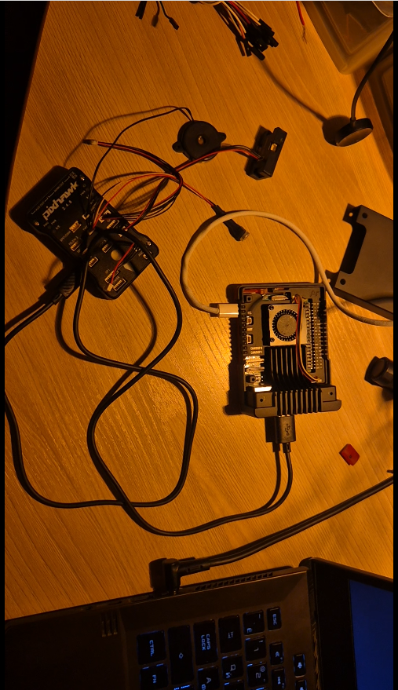
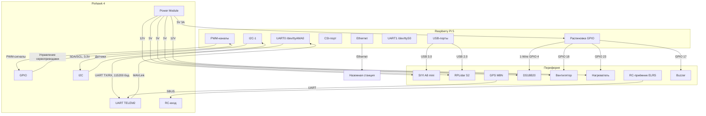

# Watchdog — персональный проект автономного дрона-разведчика

[](https://opensource.org/licenses/MIT)


**Watchdog** — пет-проект по созданию автономного квадрокоптера-разведчика с ROS2, компьютерным зрением и навигацией. Цель — исследовать и реализовать современные технологии автономных систем, от аппаратного уровня до алгоритмов машинного зрения, объединяя инженерные навыки в робототехнике, программировании и электронике.

## Ключевые технологии

- **ROS2 Humble** — основа всего программного стека
- **MAVLink / Pixhawk 4** — связь с полётным контроллером
- **YOLOv8n + ByteTrack** — детекция и трекинг объектов в реальном времени
- **SIYI A8 mini** — 3-осевой подвес с 4K камерой и 4× оптическим зумом
- **RPLidar S2** — лидарное картографирование окружения
- **Raspberry Pi 5** — бортовой компьютер для обработки данных
- **Python 3.13 + uv** — современный инструментарий разработки

## Возможности

- Автономная навигация по заданным точкам с облётом препятствий
- Детекция и трекинг людей, транспортных средств, животных
- Автоматическое слежение камеры за выбранной целью
- Лидарное построение карты местности в реальном времени
- Терморегуляция системы для работы в диапазоне −5…+30°C
- Полная интеграция с наземными станциями (Mission Planner, QGroundControl)
- Гибкое управление через RC-пульт (RadioMaster TX16 + ELRS)

## Быстрый старт

### Предварительные требования

- Raspberry Pi 5 с Ubuntu 22.04 (или x86_64 для разработки)
- ROS2 Humble ([официальная инструкция](https://docs.ros.org/en/humble/Installation/Ubuntu-Install-Debians.html))
- Python 3.13 (рекомендуется через uv)

### Установка за 5 минут

```bash
# Клонировать репозиторий
git clone https://github.com/nickihell/watchdog-node.git
cd watchdog-node

# Установить Python-зависимости (через uv)
curl -LsSf https://astral.sh/uv/install.sh | sh
uv sync --group dev

# Собрать ROS2 workspace
cd ros2_ws
colcon build --symlink-install
source install/setup.bash

# Запустить систему (симуляционный режим)
ros2 launch config/launch/drone_full.launch.py enable_detection:=false enable_thermal:=false
```

## Технические характеристики

| Параметр | Значение |
|---|---|
| Класс | 10" True-X квадрокоптер |
| Диагональ рамы | 10 дюймов (~254 мм) |
| Моторы | T-Motor MN4014 330KV × 4 |
| Пропеллеры | T-Motor P10×4.4 Carbon |
| ESC | Hobbywing XRotor 40A BLHeli32 × 4 |
| Полётный контроллер | Pixhawk 4 |
| Компьютер | Raspberry Pi 5, 8 ГБ |
| Подвес | SIYI A8 mini (3-ось, 4K, 4× zoom) |
| LiDAR | RPLidar S2 (30 м, 32 000 точек/сек) |
| Батарея | 6S 22 000 мАч LiPo |
| Сухой вес | ~1 000 г |
| MTOW | ~1 300 г |
| TWR | ~3:1 |
| Время полёта | ~40 мин |
| RC | RadioMaster TX16 + ELRS 900 МГц |
| Детекция | YOLOv8n + ByteTrack (~30 FPS) |
| Температурный диапазон | −5...+30°C |

## «Мозги дрона»





### Ключевые интерфейсы

| Интерфейс | Контакты | Назначение | Скорость/Протокол |
|-----------|----------|------------|-------------------|
| **UART0** | GPIO 14/15 | Основной канал MAVLink между Pi и Pixhawk | 115200 бод, 8N1 |
| **I2C‑1** | GPIO 2/3 | Резервный канал для датчиков (барометр, IMU) | 400 кГц |
| **USB 3.0** | USB‑A | Подключение камеры SIYI A8 mini (управление и видео) | 5 Гбит/с |
| **USB 2.0** | USB‑A | Подключение RPLidar S2 | 12 Мбит/с |
| **GPIO PWM** | GPIO 12/13 | Управление сервоприводами подвеса (резерв) | 50 Гц |
| **1‑Wire** | GPIO 4 | Датчик температуры DS18B20 | 15.3 кбит/с |
| **Ethernet** | RJ45 | Резервная связь с наземной станцией | 1 Гбит/с |
| **SBUS** | RC‑вход Pixhawk | Приём команд с RadioMaster TX16 | 100 кбит/с |

> **Примечание:** Все сигнальные линии согласованы по уровням 3.3 В. Питание периферии заведено через отдельные стабилизаторы на базе Pixhawk Power Module.

## Архитектура

Проект построен вокруг ROS2 и состоит из следующих пакетов:

| Пакет | Назначение |
|-------|------------|
| `watchdog_controller` | Главный state‑machine, управляющий режимами полёта |
| `watchdog_navigation` | Навигационный стек (планирование пути, избегание препятствий, SLAM) |
| `watchdog_pixhawk_interface` | Мост между MAVLink (Pixhawk) и ROS2 |
| `watchdog_camera` | Захват видео с SIYI A8 mini, кодирование и публикация топиков |
| `watchdog_detection` | Детекция объектов (YOLOv8n) и трекинг (ByteTrack) |
| `watchdog_gimbal` | Управление подвесом через MAVLink Gimbal v2, автослежение за целями |
| `watchdog_lidar` | Драйвер для RPLidar S2, публикация облака точек |
| `watchdog_thermal` | Терморегуляция (DS18B20, вентилятор, нагреватель) |
| `watchdog_msgs` | Пользовательские ROS2‑сообщения (Detection, DetectionArray) |
| `watchdog_common` | Общие утилиты (валидация конфигов, диагностика, логирование) |
